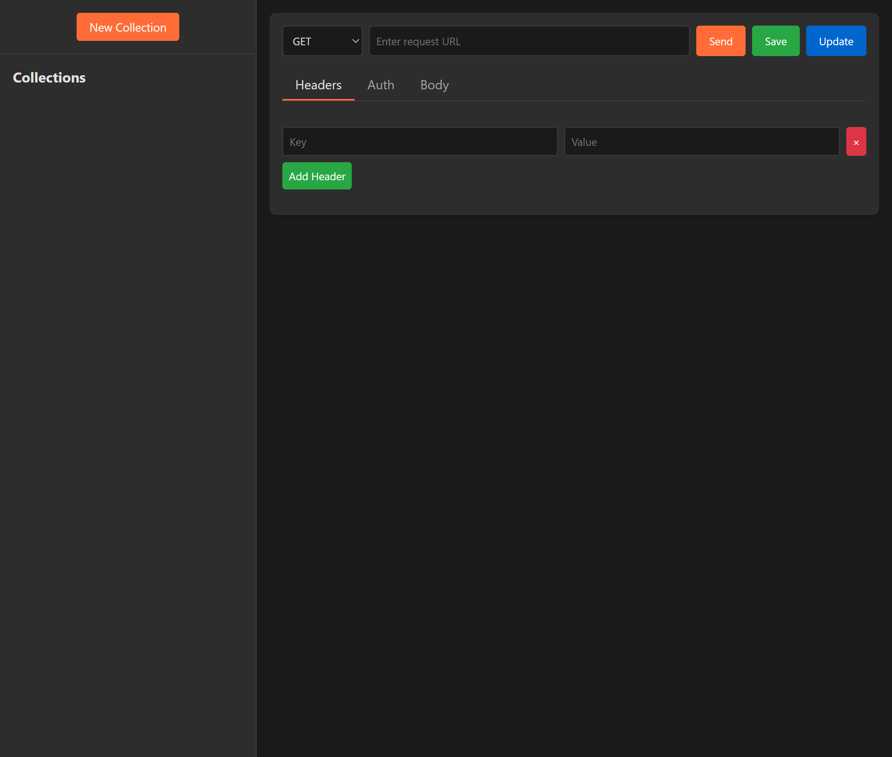

# Postman Web UI Clone

A lightweight, browser-based API testing tool inspired by Postman. This single-file web application allows you to create, save, and manage HTTP requests without requiring any installation.



## Features

- **Send HTTP Requests**: Supports GET, POST, PUT, DELETE, and PATCH methods
- **Request Configuration**: Add custom headers and request bodies
- **Authentication Support**: Multiple authentication methods including Basic Auth, Bearer Token, and API Key
- **Response Visualization**: View response status, time, and formatted JSON
- **Collection Management**: Organize requests into collections
- **Local Storage**: All collections and requests are saved in your browser
- **Clean Interface**: Simple and intuitive design focused on functionality

## Getting Started

### Installation

No installation required! Simply download the `postman.html` file and open it in any modern web browser.

```bash
# Clone this repository (if available via git)
git clone https://github.com/yourusername/postman-web-ui.git

# Or just download the HTML file and open it directly
```

## Usage Guide

### Interface Overview

The interface consists of two main sections:
- **Sidebar**: Contains your collections and saved requests
- **Main Area**: Contains the request editor and response viewer

#### Sidebar Controls

- **New Collection**: Creates a new collection to organize your requests

### Managing Collections

#### Creating a Collection

1. Click the "New Collection" button in the sidebar
2. Enter a name for your collection when prompted
3. Click OK to create the collection

#### Renaming a Collection

1. Click the ✏️ (edit) icon next to the collection name
2. Enter a new name when prompted
3. Click OK to save changes

#### Deleting a Collection

1. Click the 🗑️ (delete) icon next to the collection name
2. Confirm deletion when prompted

### Working with Requests

#### Creating and Sending a Request

1. Select a method (GET, POST, etc.) from the dropdown
2. Enter the request URL
3. Add headers (if needed) in the Headers tab
4. Configure authentication (if needed) in the Auth tab
5. Add a request body (if needed) in the Body tab
6. Click "Send" to execute the request

#### Saving a Request

1. Configure your request (method, URL, headers, auth, body)
2. Click the "Save" button
3. Enter a name for the request
4. Select a collection to save it to
5. Click OK to save

#### Loading a Saved Request

1. Expand a collection in the sidebar by clicking on it
2. Click on a request name to load it

#### Updating a Request

1. Load a saved request
2. Make your changes
3. Click the "Update" button

#### Deleting a Request

1. Hover over a request in the sidebar
2. Click the "Delete" button
3. Confirm deletion when prompted

### Request Configuration

#### Adding Headers

1. Navigate to the Headers tab
2. Enter key-value pairs for each header
3. Click "Add Header" to add more headers

#### Configuring Authentication

1. Navigate to the Auth tab
2. Select an authentication type from the dropdown:
   - **No Auth**: No authentication will be used
   - **Basic Auth**: Username and password authentication
   - **Bearer Token**: Token-based authentication (commonly used with JWT)
   - **API Key**: Key-based authentication in header or query parameter

3. Fill in the required fields for the selected authentication method:
   - **Basic Auth**: Enter username and password
   - **Bearer Token**: Enter the token value
   - **API Key**: Enter key name, value, and location (header or query parameter)

#### Adding a Request Body

1. Navigate to the Body tab
2. Enter your request body (JSON, text, etc.)

### Viewing Responses

After sending a request:
1. The response status code and time will appear at the top of the response panel
2. The response body will be displayed below, with JSON automatically formatted

## Keyboard Shortcuts

- No keyboard shortcuts are currently implemented

## Browser Compatibility

This application works in all modern browsers that support:
- ES6 JavaScript features
- Fetch API
- Local Storage
- CSS Grid and Flexbox

## Data Storage

All data is stored in your browser's local storage. Clearing your browser cache or local storage will remove your saved collections and requests.

## Contributing

Feel free to fork this repository and submit pull requests for any improvements or bug fixes.

## License

This project is open source and available under the [MIT License](LICENSE). 